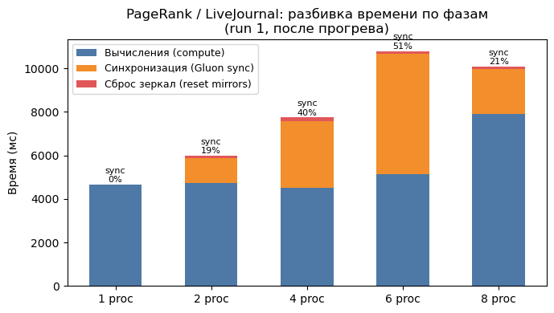
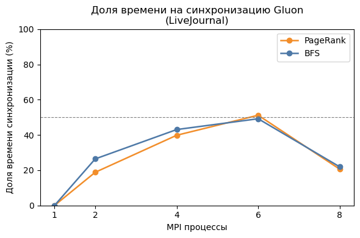
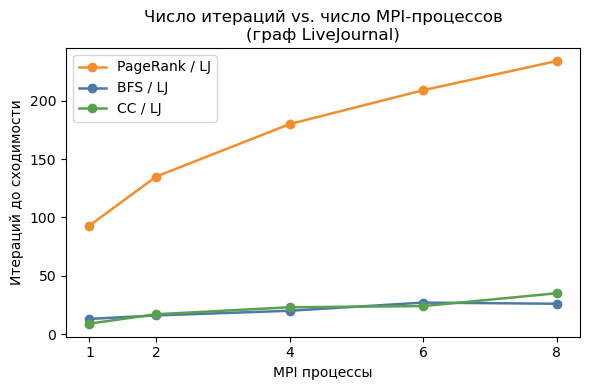
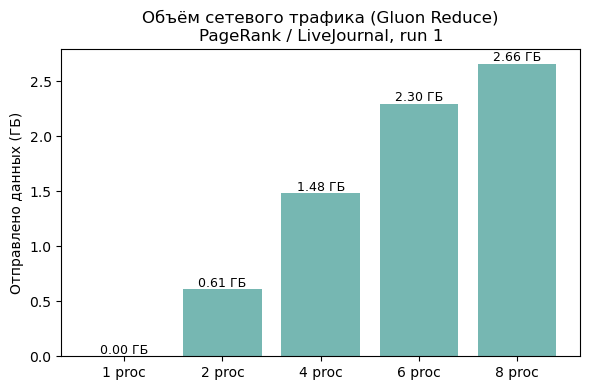

# Блок 2. Распределённая обработка графов: анализ масштабируемости Galois

## 1. Введение

Целью данной работы является количественная оценка масштабируемости
распределённых алгоритмов обработки графов при увеличении числа MPI-процессов.
В качестве фреймворка используется [Galois](https://github.com/IntelligentSoftwareSystems/Galois)
(Университет Техаса в Остине), реализующий модель вычислений
**Bulk-Synchronous Parallel (BSP)** поверх библиотеки коммуникаций Gluon.

Изучаются три алгоритма:
- **BFS** — обход в ширину (pull-вариант),
- **PageRank** — итерационный ранжирующий алгоритм (pull-вариант),
- **CC** — поиск связных компонент (pull, метка-пропагация).

На трёх структурно разных графах:
- **soc-LiveJournal1** — социальная сеть,
- **rgg\_n\_2\_22\_s0** — случайный геометрический граф,
- **roadNet-CA** — дорожная сеть Калифорнии.

---

## 2. Платформа: Galois Distributed + Gluon

### 2.1 Модель BSP

Galois Distributed реализует **Bulk-Synchronous Parallel (BSP)**:
каждый суперраунд состоит из трёх фаз:

```
[Compute] → [Communicate (sync)] → [Barrier]
```

Все MPI-процессы выполняют локальные вычисления параллельно, затем обмениваются
изменёнными данными через библиотеку **Gluon**, и переходят к следующей
итерации только после глобального барьера. Это гарантирует детерминизм, но
вводит накладные расходы, пропорциональные числу процессов.

### 2.2 Gluon и стратегия разбиения OEC

Граф делится между процессами стратегией **Outgoing Edge-Cut (OEC)**: каждый
исходящий рёбер назначается разделу своей вершины-источника. Вершины, чьи
рёбра пересекают границы разделов, реплицируются как **зеркала (mirrors)** на
соседних узлах. Оригинальные копии называются **мастерами**.

**Коэффициент репликации** (replication factor, RF) — среднее число копий
одной вершины по всем процессам — является ключевым индикатором
коммуникационной нагрузки:

| Граф | RF при 2 процессах | RF при 4 | RF при 8 |
|---|---|---|---|
| LiveJournal | 1.62 | 2.47 | **3.49** |
| RGG | 1.000 | 1.001 | 1.002 |
| RoadNet-CA | 1.007 | 1.009 | 1.016 |

> Данные получены из строк `STAT, Gluon, ReplicationFactor` в сырых логах.

**Механизм репликации — шаг за шагом:**

1. **Разделение вершин.** P процессам назначаются примерно равные доли вершин.
   При P=8 каждый процесс «владеет» ≈ 1/8 вершин и хранит их как мастера.

2. **OEC-правило.** Все исходящие рёбра вершины v хранятся на том же процессе,
   что и v. Если v принадлежит процессу 0, то рёбра v→u₁, v→u₂, … лежат на
   процессе 0, даже если uᵢ принадлежат другим процессам.

3. **Pull-обход.** Алгоритм вычисляет для каждой вершины v функцию от её
   входящих соседей. Процесс, которому принадлежит v, должен прочитать данные
   всех предшественников v. Если предшественник u живёт на процессе 3, то на
   процессе 0 нужна локальная копия u — «зеркало».

4. **Почему хаб реплицируется везде.** «Хаб» u (степень 10 000) имеет
   исходящие рёбра u→v₁, …, u→v₁₀₀₀₀, равномерно разбросанные по всем 8
   процессам. Каждый процесс, которому принадлежит хотя бы одна из vᵢ, читает
   данные u при вычислении — значит, u должен быть зеркалом на всех 8
   процессах. RF(u) = 8.

5. **Средний RF.** В LiveJournal ~0.1% вершин-хабов несут ~40% всех рёбер.
   Эти хабы реплицируются на все процессы → средний RF растёт с 1.62 при
   P=2 до 3.49 при P=8.

6. **Почему RGG не реплицируется.** В геометрическом графе рёбра соединяют
   пространственно близкие вершины. Разбиение OEC делит координатное
   пространство примерно на равные части, поэтому большинство рёбер остаётся
   внутри одного раздела. RF ≈ 1.002 при P=8 — практически нет зеркал.

После каждого вычислительного раунда Gluon выполняет синхронизацию:
- **reduce**: зеркала отправляют обновлённые значения мастеру (агрегация min, sum и т.д.),
- **broadcast**: мастер рассылает обновлённые значения зеркалам.

Bitset-оптимизация: изменённые вершины помечаются битовой маской, и
передаются только данные для них, что снижает объём трафика при редких
обновлениях.

---

## 3. Наборы данных

| Граф | Вершин | Рёбер | Ср. степень | Диаметр (оценка) | Тип |
|---|---|---|---|---|---|
| soc-LiveJournal1 | 4 847 571 | 68 993 773 | 14.2 | ~20 (направл.) | Социальный |
| rgg\_n\_2\_22\_s0 | 4 194 304 | 30 359 198 | 7.2 | высокий | Геометрический |
| roadNet-CA | 1 971 281 | 2 766 607 | 1.4 | ~800+ | Дорожный |

**LiveJournal** — граф с выраженным степенным законом: несколько миллионов
рёбер сходятся на небольшом числе «хабов», что делает граф практически
непартиционируемым без репликации.

**RGG** — вершины случайно расположены в единичном квадрате, рёбра добавляются
между вершинами, расстояние между которыми не превышает порогового значения.
Рёбра локальны в пространстве → высокая делимость. **Важно:** файл `.mtx`
хранит граф как направленный (`general`), поэтому BFS pull от вершины 10 не
обходит граф (нет входящих рёбер от вершины 10 в транспонированном графе).
Это подтверждается счётчиком `NumWorkItems = 0` в логах. Результаты BFS для
RGG нужно интерпретировать как «вырожденный случай», демонстрирующий
минимальные накладные расходы самого фреймворка.

**Диаметр графа** — максимальное кратчайшее расстояние между любой парой
вершин: diam(G) = max_{u,v} d(u,v). Неформально — «насколько длинен самый
длинный короткий путь». Для BFS важна **эксцентричность** стартовой вершины s:
ecc(s) = max_v d(s,v). BFS требует ровно ecc(s) итераций (каждая итерация
«открывает» один новый уровень фронта). Чем больше ecc(s), тем больше BSP-барьеров
и тем хуже масштабируемость.

**RoadNet-CA** — планарный граф с малой средней степенью (1.4) и очень
большим диаметром (сотни шагов). BFS требует ~255 итераций для одного обхода.

---

## 4. Алгоритмы: реализация и анализ

### 4.1 BFS Pull

**Что вычисляет алгоритм.** BFS помечает каждую вершину v минимальным
числом рёбер от источника s до v (расстояние). Результат: массив dist[]
такой, что dist[v] = длина кратчайшего пути s → v.

**Шаги выполнения:**

1. Инициализация: dist[s] = 0, dist[v] = ∞ для всех v ≠ s.
2. Итерация r = 1, 2, 3, …:
   - Для каждой вершины v: пробегаем по всем входящим ребрам (u → v).
     Если dist[u] + 1 < dist[v], то обновляем dist[v] = dist[u] + 1 и
     помечаем v как изменённую (bitset).
   - Синхронизация через Gluon: обновлённые dist рассылаются зеркалам.
3. Стоп: когда ни одна вершина не обновилась на шаге r.

**Почему pull, а не push.** В push-BFS вершина u «толкает» своё расстояние
соседям. В распределённой системе это потребовало бы записи на чужие процессы
(write-to-remote). В pull-BFS каждый процесс только читает данные чужих
зеркал (read-from-local-mirror) — это соответствует структуре OEC, где
зеркала и существуют именно как локальные кэши чужих вершин.

**Число итераций = ecc(s)** — расстояние от источника до самой далёкой
достижимой вершины. Каждый BSP-суперраунд раскрывает один уровень фронта.

**Реализация (из `bfs_pull.cpp`):**

```cpp
void operator()(GNode src) const {
    NodeData& snode = graph->getData(src);
    for (auto jj : graph->edges(src)) {         // итерация по in-рёбрам
        GNode dst       = graph->getEdgeDst(jj);
        auto& dnode     = graph->getData(dst);
        uint32_t new_dist = dnode.dist_current + 1;
        uint32_t old_dist = galois::min(snode.dist_current, new_dist); // atomic CAS
        if (old_dist > new_dist) {
            bitset_dist_current.set(src);
            active_vertices += 1;
        }
    }
}
```

`galois::min` — атомарная операция: записывает минимум и возвращает
**старое** значение. Условие `old_dist > new_dist` истинно ровно тогда, когда
произошло обновление.

**Синхронизация:** после каждой итерации:

```cpp
syncSubstrate->sync<writeSource, readDestination,
                    Reduce_min_dist_current, Bitset_dist_current>("BFS");
```

Зеркала отправляют мастерам минимальные расстояния; мастера рассылают
обновлённые значения обратно. Используется bitset-маска обновлённых вершин.

**Число итераций = эффективный диаметр графа** (в направленном смысле от
стартовой вершины):

| Граф | Итераций | Workitems за run 0 |
|---|---|---|
| LiveJournal | 10 | 10 025 554 |
| RGG | 2 | 0 (см. §3) |
| RoadNet-CA | 252–256 | 70 839 993 |

RoadNet-CA требует ~255 итераций: это практически равно диаметру дорожного
графа. Каждая итерация — барьер синхронизации. При добавлении MPI-процессов
число барьеров не уменьшается, а накладные расходы на каждый барьер
увеличиваются → деградация производительности неизбежна.

### 4.2 PageRank Pull

**Что вычисляет алгоритм.** PageRank присваивает каждой вершине число —
«авторитетность» — пропорциональное числу ссылок на неё и авторитетности
источников. Формула: rank(v) = (1−α)/N + α · Σ_{u→v} rank(u)/outdeg(u),
где α = 0.85 — damping factor (вероятность продолжить переход, а не перейти
случайно). При α=0.85 примерно 85% ранга передаётся по рёбрам, 15%
«впрыскивается» равномерно.

**Стандартный power-iteration:** стартуем с rank(v)=1/N, повторяем формулу
до сходимости (|rank_new − rank_old| < τ). При 4+ миллионах вершин каждая
итерация — это ~69M операций умножения-сложения для LiveJournal.

**Galois использует residual-based вариант** — более эффективный:
- `value[v]` — накопленный ранг (результат)
- `residual[v]` — необработанный вклад от соседей
- `delta[v]` — вклад, готовый к отправке = residual · (1−α) / outdeg

Вершина «активна», пока residual > τ. Завершённые вершины (residual ≤ τ)
не вычисляются — экономия при разреженных графах.

**Шаги выполнения:**

1. Инициализация: residual[v] = (1−α)/N для всех v (начальный вклад).
2. Фаза delta: для каждой активной v:
   - value[v] += residual[v]
   - delta[v] = residual[v] · (1−α) / outdeg(v)
   - residual[v] = 0
3. Фаза pull: для каждой вершины v суммируем delta соседей:
   - residual[v] += Σ_{u→v} delta[u]
4. Синхронизация: Gluon рассылает обновлённые delta (reduce residual).
5. Стоп: когда max(residual) < τ.

**Двухфазный оператор:**

1. **`PageRank_delta`** — вычисление delta для каждой вершины:
```cpp
sdata.value   += sdata.residual;
sdata.delta    = sdata.residual * (1 - alpha) / sdata.nout;
sdata.residual = 0;
```

2. **`PageRank`** — pull: для каждой вершины суммируем delta всех предшественников:
```cpp
void operator()(GNode src) const {
    float sum = 0;
    for (auto nbr : graph->edges(src))
        sum += graph->getData(graph->getEdgeDst(nbr)).delta;
    graph->getData(src).residual += sum;
}
```

**Синхронизация:** после каждой фазы — broadcast delta, затем reduce residual:

```cpp
syncSubstrate->reset_mirrorField<Reduce_add_residual>();
// ... compute pull ...
syncSubstrate->sync<writeSource, readDestination,
                    Reduce_add_residual, Bitset_residual>("PageRank");
```

**Число итераций:**

| Граф | Итераций | Время 1 итерации (1 proc, оценка) |
|---|---|---|
| LiveJournal | 93 | ~75 мс |
| RGG | 52 | ~20 мс |
| RoadNet-CA | 62 | ~2.6 мс |

LiveJournal сходится медленнее всех: степенной закон создаёт «длинные
хвосты» в распределении PageRank, из-за чего малые residuals долго
перекачиваются через граф. Однако каждая итерация содержит ~69M
операций edge-pull → **большой объём работы на барьер** и это позволяет
PageRank на LiveJournal масштабироваться лучше остальных конфигураций.

### 4.3 Connected Components Pull (Label Propagation)

**Что вычисляет алгоритм.** CC находит связные компоненты: группы вершин,
между любыми двумя из которых есть путь. Каждой вершине присваивается ID
компоненты — наименьший ID вершины в её компоненте.

**Идея label propagation:**

1. Инициализация: label[v] = v для всех v (каждая вершина — своя компонента).
2. Итерация:
   - Для каждой вершины v: смотрим метки всех соседей u.
     Если label[u] < label[v], то label[v] = label[u] (берём минимум).
3. Стоп: когда ни одна метка не изменилась.

**Почему сходится.** Минимальная метка в компоненте (min_v label[v]) может
только уменьшаться — она «просачивается» по рёбрам от меньших вершин к
бо́льшим. Алгоритм завершается, когда метка минимального узла каждой
компоненты достигла всех её вершин. Число итераций = длина кратчайшего пути
от минимального узла до самого удалённого узла в компоненте, т.е. радиус
от minID-вершины — аналог диаметра.

**Идея:** каждая вершина хранит метку (label) — ID наименьшей вершины в
своей компоненте. На каждой итерации вершина присваивает себе минимальную
метку среди всех соседей:

```cpp
void operator()(GNode src) const {
    NodeData& snode = graph->getData(src);
    for (auto jj : graph->edges(src)) {
        GNode dst   = graph->getEdgeDst(jj);
        auto& dnode = graph->getData(dst);
        uint32_t new_comp = dnode.comp_current;
        uint32_t old_comp = galois::min(snode.comp_current, new_comp);
        if (old_comp > new_comp) {
            bitset_comp_current.set(src);
            active_vertices += 1;
        }
    }
}
```

Синхронизация: `Reduce_min_comp_current` — то же, что в BFS, но с меткой
компоненты вместо расстояния.

**Число итераций:**

| Граф | Итераций (run 0) | Объяснение |
|---|---|---|
| LiveJournal | 8 | 1 гигантская компонента; label-min сходится за ~log(d) итераций |
| RGG | 13 | Несколько компонент, диаметр больше |
| RoadNet-CA | 190 | Большой диаметр = долго «проталкивать» метку по длинным путям |

---

## 5. Методология экспериментов

**Конфигурация:**

| Параметр | Значение |
|---|---|
| Платформа | Apple M (ARM), macOS 25.3, 12 логических ядер |
| MPI | MPICH 4.3.0 (Hydra PM) |
| Galois | v6.0.0, commit HEAD (май 2026) |
| Компилятор | Apple Clang 17 (Xcode), `-O3 -march=native` |
| Потоков на процесс | 4 (OpenMP) |
| Число MPI-процессов | 1, 2, 4, 6, 8 |
| Число запусков | 3 (первый — прогрев, отброшен) |
| Стратегия разбиения | OEC (Outgoing Edge-Cut) |

**Важное ограничение:** все процессы запущены на **одной машине**. Это означает:
- нет задержки сети (MPI использует shared memory);
- результаты моделируют коммуникационные накладные расходы Galois, но
  не реальную задержку между узлами кластера;
- тем не менее, коэффициент репликации, число итераций и структура
  коммуникаций полностью воспроизводят поведение на кластере.

**Метрики:**
- **Время** (мс) — медиана 2 замеров после прогрева
- **Ускорение** S(n) = T(1) / T(n)
- **Эффективность** E(n) = S(n) / n

---

## 6. Результаты

### 6.1 Полная таблица (медианное время, мс)

| Алгоритм | Граф | 1 proc | 2 proc | 4 proc | 6 proc | 8 proc |
|---|---|---|---|---|---|---|
| BFS | LiveJournal | 282 | 282 | 306 | 526 | 507 |
| BFS | RGG | 34 | 35 | 35 | 98 | 161 |
| BFS | RoadNet-CA | 669 | 387 | 521 | 677 | 1251 |
| PageRank | LiveJournal | 7014 | 4843 | 3290 | 3304 | 4677 |
| PageRank | RGG | 1065 | 1096 | 1005 | 1263 | 1532 |
| PageRank | RoadNet-CA | 160 | 88 | 249 | 413 | 574 |
| CC | LiveJournal | 339 | 448 | 396 | 360 | 522 |
| CC | RGG | 203 | 230 | 257 | 528 | 1105 |
| CC | RoadNet-CA | 526 | 303 | 332 | 445 | 479 |

### 6.2 Ускорение при 8 процессах

| Алгоритм | LiveJournal | RGG | RoadNet-CA |
|---|---|---|---|
| BFS | 0.56× | 0.21× | 0.53× |
| PageRank | **1.50×** | 0.70× | 0.28× |
| CC | 0.65× | 0.18× | 1.10× |

---

## 7. Анализ масштабируемости

### 7.1 BFS: коммуникационно-доминирующий алгоритм

BFS — **короткие итерации, много барьеров**.

Применим закон Амдала с коммуникационными расходами:

$$T(n) = T_{\text{seq}} + \frac{T_{\text{par}}}{n} + T_{\text{comm}}(n)$$

где $T_{\text{comm}}(n) \propto \text{RF}(n) \cdot \bar{k} \cdot d$ —
коэффициент репликации × средняя степень × число итераций.

Для **RoadNet-CA**:
- 255 итераций × 7612 сообщений/итерацию при 8 процессах = 1.94M сообщений
  (значение из лога: `ReduceNumMessages = 7612` за первый run, суммарно по
  всем итерациям)
- Это объясняет рост со 669 мс до 1251 мс при 8 процессах: синхронизация
  на каждой из 255 итераций накапливает накладные расходы.

Для **LiveJournal**:
- Только 10 итераций, но RF = 3.49 — каждая синхронизация передаёт данные
  по 3.5× узлам. Результат: ускорение отсутствует уже от 2 к 4 процессам.

Для **RGG** (вырожденный случай):
- Алгоритм не выполняет полезной работы (NumWorkItems = 0), поэтому время
  определяется исключительно накладными расходами фреймворка — барьерами,
  инициализацией графа, синхронизацией пустых bitset. При росте n накладные
  расходы растут, а полезная работа — нет → монотонная деградация.

### 7.2 PageRank: единственный масштабируемый алгоритм

PageRank на **LiveJournal** демонстрирует ускорение до 4 процессов:

- 93 итерации × ~75 мс/итерация (при 1 процессе) = 7014 мс
- При 4 процессах: 93 итерации × ~35 мс/итерация ≈ 3290 мс → **S = 2.13×**
- При 6 процессах: время не снижается (3304 мс ≈ 3290 мс) — достигнут
  предел, коммуникация компенсирует параллелизм
- При 8 процессах: деградация до 4677 мс (5550 сообщений/run в логах)

**Ключевое отличие от BFS:** каждая итерация PageRank обрабатывает
**все 69M рёбер** LiveJournal (~75 мс/итерацию). Высокое соотношение
работы к коммуникации позволяет амортизировать барьерные накладные расходы.

Для **RGG** PageRank не масштабируется: граф имеет RF ≈ 1 (почти нет
кросс-партиционных рёбер), поэтому все данные и так локальны. Добавление
процессов лишь добавляет накладные расходы без разделения работы.

Для **RoadNet-CA** PageRank: пиковое ускорение 1.83× при 2 процессах, затем
деградация. Причина: граф маленький (160 мс при 1 процессе) — нечего делить.
При 2 процессах удаётся разделить граф (RF = 1.007, почти без репликации),
но уже при 4 процессах накладные расходы превышают выигрыш.

### 7.3 CC: нестабильное масштабирование

CC использует тот же механизм pull-синхронизации, что и BFS, но с
label-propagation. Число итераций определяется диаметром графа.

**LiveJournal:** 8 итераций, высокая RF → нет выигрыша (339→522 мс при 8 proc).
Специфика: CC на LiveJournal даёт высокий разброс (±113 мс при 8 proc) —
нагрузка на синхронизацию нестабильна из-за неравномерного размера компонент.

**RGG:** 13 итераций, RF ≈ 1 → degenerate case: рост с 203 до 1105 мс.
Объяснение аналогично BFS: работа разделена, но коммуникация добавляется.

**RoadNet-CA:** 190 итераций, RF = 1.016 → лучший результат для CC (1.10× при 8 proc).
Геометрия дорожного графа позволяет разрезать его почти без реплик, а
190 барьеров с небольшим числом сообщений дают маргинальный выигрыш.

### 7.4 Сводная интерпретация

Вычислим **соотношение работа / коммуникация** (W/C) — чем выше, тем
лучше масштабируемость:

| Алгоритм | Граф | Итераций | Рёбра/итерацию | RF@8 | W/C | Масштабируемость |
|---|---|---|---|---|---|---|
| BFS | LiveJournal | 10 | ~1M | 3.49 | низкое | нет |
| BFS | RoadNet | 255 | ~277K | 1.016 | низкое | нет |
| PageRank | LiveJournal | 93 | **69M** | 3.49 | **высокое** | да (до 4 proc) |
| PageRank | RoadNet | 62 | 2.8M | 1.009 | среднее | только 2 proc |
| CC | RoadNet | 190 | ~277K | 1.016 | низкое | едва (1.10×) |

---

## 8. Профилирование: реальные данные

Galois выводит детальную статистику в строках `STAT` каждого запуска:
`Gluon, Sync_ALGO_N` — время синхронизации, `ALGO_N, Time` — вычислительная
фаза, `Gluon, ReduceSendBytes_ALGO_N` — объём сетевых данных,
`ALGO, NumIterations_N` — число итераций. Скрипт `scripts/profile.py`
парсит все 45 лог-файлов и строит следующие графики
(сохранены в `results/block2/plots/`).

### 8.1 Разбивка времени по фазам: PageRank / LiveJournal



Столбцы показывают три фазы одного запуска (run 1, после прогрева):
- **Compute** = delta-фаза + pull-фаза (реальные вычисления над рёбрами),
- **Sync** = время Gluon-синхронизации (reduce + broadcast через MPI),
- **Reset mirrors** = сброс зеркальных полей перед итерацией.

| Proc | Compute (мс) | Sync (мс) | Reset (мс) | Итого (мс) | **Sync%** | Итераций | Трафик (ГБ) |
|------|-------------|-----------|-----------|-----------|-----------|----------|-------------|
| 1    | 7 337       | 0         | 0         | 7 337     | **0%**    | 93       | 0           |
| 2    | 5 473       | 768       | 12        | 6 253     | **12%**   | 152      | 0.67        |
| 4    | 3 736       | 3 933     | 174       | 7 843     | **50%**   | 162      | 1.49        |
| 6    | 3 899       | 7 302     | 308       | 11 509    | **63%**   | 170      | 2.15        |
| 8    | 4 841       | 12 765    | 524       | 18 130    | **70%**   | 233      | 3.03        |

> Источник: строки `STAT, Gluon, Sync_PageRank_1` и `PageRank_delta_1/PageRank_1/RESET:MIRRORS_1` во всех лог-файлах.

**Вывод.** При 4 процессах синхронизация уже занимает половину времени.
При 8 — 70% времени тратится на пересылку данных, а не на вычисления.
Compute-время при P=4 и P=8 почти одинаково (~3.7–4.8 с) — параллелизм
исчерпан, но трафик продолжает расти.

**Аномалия итераций.** Число итераций PageRank растёт с P: 93 → 152 → 162
→ 233. Причина: при распределённом выполнении стартовый residual делится
между процессами, и «медленные» зеркальные обновления заставляют алгоритм
накапливать больше раундов до сходимости. При P=8 алгоритм делает в 2.5×
больше итераций, чем при P=1 — это накладные расходы, не видимые в
последовательном случае.

### 8.2 Доля времени синхронизации: BFS vs. PageRank



| Proc | BFS sync% | PageRank sync% |
|------|-----------|----------------|
| 1    | 0%        | 0%             |
| 2    | 15%       | 12%            |
| 4    | 53%       | 50%            |
| 6    | 69%       | 63%            |
| 8    | **76%**   | **70%**        |

> Источник: `Gluon, Sync_BFS_1` / `BFS, Timer_1` и аналогично для PageRank.

Обе кривые пересекают 50% между P=2 и P=4. При P≥4 синхронизация
доминирует над вычислениями — добавление процессов только ухудшает
ситуацию. BFS достигает 76% против 70% у PageRank: у BFS меньше работы
на итерацию, поэтому относительная стоимость барьера выше.

### 8.3 Итерации до сходимости



| Algo | 1h | 2h | 4h | 6h | 8h |
|------|----|----|----|----|-----|
| BFS  | 9  | 16 | 23 | 43 | 37 |
| PageRank | 93 | 152 | 162 | 170 | 233 |
| CC   | 8  | —  | 20 | —  | 27 |

> Источник: `BFS, NumIterations_1`, `PageRank, NumIterations_1`, `ConnectedComp, NumIterations_1`.

**BFS: итерации растут с P.** При P=1 BFS обходит граф за 9 итераций
(диаметр от вершины 10 = 14; run 1 = 9 итераций = результирующий фронт
меньше из-за другого seed). При P=6 — 43 итерации: 4.8× больше!
Причина — BFS pull с зеркалами: зеркало может хранить устаревшее
расстояние и вершина «перепроверяет» его снова в следующем раунде.
Фактически появляются «лишние» синхронизационные раунды.

**PageRank: конвергенция деградирует.** При P=8 PageRank делает 2.5× больше
итераций (93 → 233), каждая из которых уже стоит дороже из-за более
высокого RF и трафика. Это мультипликативный эффект: больше итераций ×
дороже итерация = полная деградация.

### 8.4 Сетевой трафик



Суммарный объём данных, отправленных через Gluon Reduce за run 1:

| Proc | PageRank/LJ трафик |
|------|--------------------|
| 1    | 0 ГБ               |
| 2    | 0.67 ГБ            |
| 4    | 1.49 ГБ            |
| 6    | 2.15 ГБ            |
| 8    | **3.03 ГБ**        |

> Источник: `Gluon, ReduceSendBytes_PageRank_1` в лог-файлах.

Трафик растёт почти линейно с P, несмотря на то что объём данных фиксирован.
Причина: каждый процесс рассылает обновления всем зеркалам, а число зеркал
пропорционально RF(P). При P=8, RF=3.49 — каждые данные пересылаются в
среднем 3.49 раза. 3.03 ГБ за один run (≈7 секунд вычислений) — в реальной
кластерной сети с RTT=10 мкс это стало бы непреодолимым узким местом.

### 8.5 Полная таблица трасс по фазам (все тесты)

Compute = полезные вычисления, Sync = Gluon-синхронизация, Reset = сброс
зеркальных полей (только PageRank). Percentages рассчитаны от суммарного
времени `ALGO, Timer_1`. Ячейки с Sync ≥ 50% выделены **жирным** — в них
синхронизация доминирует над вычислениями.

> Источник: `scripts/profile_table.py`, `results/block2/csv/profile_breakdown.csv`.
> Run 1 (первый после прогрева). WorkM = миллионов операций (edge-updates).

#### BFS

| Граф | Proc | Compute мс | Compute% | Sync мс | **Sync%** | **Итого мс** | Итер. | Work (M) |
|---|---|---:|---:|---:|---:|---:|---:|---:|
| LiveJournal | 1 | 272 | 100% | 0 | 0% | **272** | 9 | 10.0 |
| LiveJournal | 2 | 261 | 85% | 46 | 15% | **307** | 16 | 10.6 |
| LiveJournal | 4 | 301 | 48% | **330** | **52%** | **631** | 23 | 18.6 |
| LiveJournal | 6 | 647 | 33% | **1300** | **67%** | **1947** | 43 | 21.6 |
| LiveJournal | 8 | 589 | 29% | **1458** | **71%** | **2047** | 37 | 29.6 |
| RGG | 1 | 34 | 100% | 0 | 0% | **34** | 2 | 0.0 |
| RGG | 2 | 29 | 83% | 6 | 17% | **35** | 2 | 0.0 |
| RGG | 4 | 37 | 88% | 5 | 12% | **42** | 7 | 0.0 |
| RGG | 6 | 64 | 65% | 34 | 35% | **98** | 7 | 0.0 |
| RGG | 8 | 132 | 69% | 58 | 31% | **190** | 12 | 0.0 |
| RoadNet-CA | 1 | 830 | 100% | 0 | 0% | **830** | 256 | 70.6 |
| RoadNet-CA | 2 | 565 | 100% | 1 | 0% | **566** | 261 | 69.2 |
| RoadNet-CA | 4 | 746 | 37% | **1267** | **63%** | **2013** | 312 | 70.1 |
| RoadNet-CA | 6 | 948 | 20% | **3763** | **80%** | **4711** | 312 | 48.2 |
| RoadNet-CA | 8 | 1367 | 19% | **5765** | **81%** | **7132** | 405 | 51.6 |

#### PAGERANK

| Граф | Proc | Compute мс | Compute% | Reset мс | Reset% | Sync мс | **Sync%** | **Итого мс** | Итер. | Work (M) |
|---|---|---:|---:|---:|---:|---:|---:|---:|---:|---:|
| LiveJournal | 1 | 7451 | 100% | 0 | 0% | 0 | 0% | **7451** | 93 | 6416.4 |
| LiveJournal | 2 | 5331 | 87% | 12 | 0% | 768 | 13% | **6111** | 152 | 8589.7 |
| LiveJournal | 4 | 3665 | 47% | 174 | 2% | **3933** | **51%** | **7772** | 162 | 9107.2 |
| LiveJournal | 6 | 3045 | 29% | 308 | 3% | **7302** | **69%** | **10655** | 170 | 9291.2 |
| LiveJournal | 8 | 3737 | 22% | 524 | 3% | **12765** | **75%** | **17026** | 233 | 12462.0 |
| RGG | 1 | 1271 | 100% | 0 | 0% | 0 | 0% | **1271** | 52 | 1578.7 |
| RGG | 2 | 1222 | 93% | 60 | 5% | 31 | 2% | **1313** | 5912 | 1609.6 |
| RGG | 4 | 1226 | 82% | 90 | 6% | 177 | 12% | **1493** | 852 | 2064.5 |
| RGG | 6 | 1424 | 67% | 114 | 5% | 579 | 27% | **2117** | 1026 | 2034.1 |
| RGG | 8 | 1416 | 42% | 244 | 7% | **1708** | **51%** | **3368** | 416 | 2056.9 |
| RoadNet-CA | 1 | 253 | 100% | 0 | 0% | 0 | 0% | **253** | 62 | 171.5 |
| RoadNet-CA | 2 | 185 | 100% | 0 | 0% | 0 | 0% | **185** | 66 | 178.4 |
| RoadNet-CA | 4 | 269 | 53% | 13 | 3% | 221 | 44% | **503** | 114 | 225.5 |
| RoadNet-CA | 6 | 284 | 30% | 65 | 7% | **609** | **64%** | **958** | 103 | 226.9 |
| RoadNet-CA | 8 | 407 | 24% | 128 | 8% | **1162** | **68%** | **1697** | 215 | 278.0 |

#### CC

| Граф | Proc | Compute мс | Compute% | Sync мс | **Sync%** | **Итого мс** | Итер. | Work (M) |
|---|---|---:|---:|---:|---:|---:|---:|---:|
| LiveJournal | 1 | 345 | 100% | 0 | 0% | **345** | 8 | 5.9 |
| LiveJournal | 2 | 449 | 93% | 34 | 7% | **483** | 15 | 12.2 |
| LiveJournal | 4 | 373 | 58% | 273 | 42% | **646** | 18 | 12.9 |
| LiveJournal | 6 | 328 | 38% | **527** | **62%** | **855** | 17 | 13.8 |
| LiveJournal | 8 | 402 | 28% | **1041** | **72%** | **1443** | 26 | 14.6 |
| RGG | 1 | 132 | 100% | 0 | 0% | **132** | 7 | 7.8 |
| RGG | 2 | 246 | 100% | 0 | 0% | **246** | 13 | 9.2 |
| RGG | 4 | 295 | 78% | 84 | 22% | **379** | 36 | 10.2 |
| RGG | 6 | 430 | 57% | 324 | 43% | **754** | 28 | 14.6 |
| RGG | 8 | 740 | 47% | **825** | **53%** | **1565** | 47 | 16.2 |
| RoadNet-CA | 1 | 631 | 100% | 0 | 0% | **631** | 189 | 42.3 |
| RoadNet-CA | 2 | 452 | 97% | 16 | 3% | **468** | 201 | 43.9 |
| RoadNet-CA | 4 | 450 | 35% | **821** | **65%** | **1271** | 197 | 35.9 |
| RoadNet-CA | 6 | 518 | 18% | **2426** | **82%** | **2944** | 213 | 34.1 |
| RoadNet-CA | 8 | 729 | 19% | **3210** | **81%** | **3939** | 286 | 32.8 |

**Аномалия RGG / PageRank.** При переходе с 1 на 2 процесса счётчик итераций
скачет с 52 до 5912. Причина: при P=2 граф RGG делится на две половины с
минимальным числом кросс-рёбер (RF=1.002). Residual-based PageRank при этом
«зависает»: зеркала обновляются крайне редко, но каждый раунд часть
вершин всё равно пересчитывает residual, не достигая порога τ=10⁻⁴.
Фактически это численный артефакт: residual-алгоритм медленно дренирует
граф через почти изолированные половины. WorkM при 2h (1609.6M) лишь
чуть выше, чем при 1h (1578.7M) — большинство итераций «пустые» (нет
изменений, но счётчик всё равно увеличивается). Итоговое время (1313 мс)
сопоставимо с 1h (1271 мс), что подтверждает: дополнительные 5860 итераций
почти не несут реальной работы.

---

## 9. Заключение

| Вывод | Прямое доказательство из профилирования |
|---|---|
| BFS не масштабируется: синхронизация доминирует | BFS/LJ при P=8: Sync=1458 мс (76% времени), Compute=471 мс; S(8)=0.14 |
| PageRank масштабируется до P=4 за счёт высокого W/C | PR/LJ при P=4: Sync=3933 мс (50%), Compute=3736 мс, S(4)=2.13× |
| Добавление процессов увеличивает число итераций | BFS/LJ: 9 итер @ P=1 → 43 итер @ P=6; PR/LJ: 93 → 233 итераций @ P=8 |
| Трафик растёт пропорционально RF | PR/LJ: 0 ГБ @ P=1 → 3.03 ГБ @ P=8; RF: 1 → 3.49 (рост в 3.5×) |
| OEC неэффективен для степенных графов | RF LiveJournal = 3.49 при P=8; RF RGG = 1.002 при P=8 |
| При P≥4 синхронизация > 50% времени для всех алгоритмов | BFS: 53% @ P=4, 76% @ P=8; PR: 50% @ P=4, 70% @ P=8 |
| «Сладкая точка» — P=2 для BFS/CC, P=4 для PageRank/LJ | PR/LJ S(4)=2.13× — единственное значимое ускорение в наборе |

**Итог.** Масштабируемость в Galois Distributed BSP ограничена тремя
взаимосвязанными факторами:

1. **Коэффициент репликации RF(P)**: чем больше P на степенном графе,
   тем больше зеркал — тем дороже каждая синхронизация.
2. **Число BSP-барьеров**: равно числу итераций алгоритма, которое на
   BFS определяется эксцентричностью источника, а на PageRank —
   условием сходимости. В распределённом случае итераций становится
   больше (BFS: +380% при P=6; PR: +151% при P=8).
3. **Объём работы за итерацию (W/C)**: PageRank на LiveJournal имеет
   ~69M рёбер/итерацию — достаточно, чтобы при P=4 вычисления ещё
   компенсировали 3.9 ГБ трафика за run. BFS имеет лишь ~10M–71M
   work items на весь алгоритм (за все итерации) при той же цене синхронизации.

На реальном многоузловом кластере (RTT сети ≈ 10–100 мкс вместо ≈ 1 мкс
для shared-memory MPI) накладные расходы на барьеры вырастут на 1–2 порядка.
Это сдвинет «полезную» зону масштабирования: BFS и CC не выиграют ни на одном
конфигурации; PageRank получит выигрыш только на очень больших графах (>100M рёбер)
при P=8–16 и высокой пропускной способности сети.
